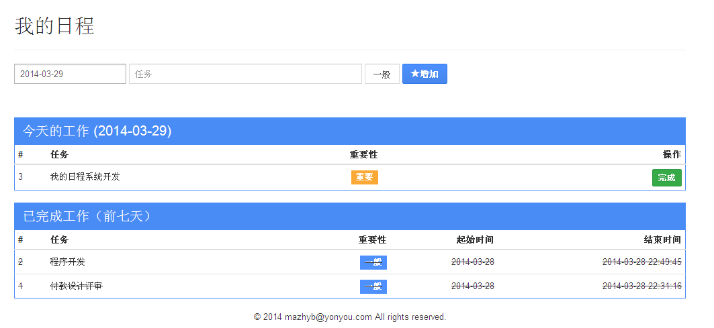

myschedule
==========

我的日程管理

>version 0.3 开发计划
>>1. 添加任务备注
>>2. 添加任务备注查看
>>3. 404错误
>>4. 500错误
>
>version 0.2 开发计划
>>0. 注册用户，退出账户，修改密码
>>1. 修改日历控件，接收时间
>>2. 查看明天的任务
>>3. 任务显示添加时间
>
>version 0.1  2014-03-29
>>界面截图：
>>
>

------------------
###技术路线选择：###
>1. golang
>2. grilla\mux
>3. bootstrap
>4. angularjs
>5. sqlite3